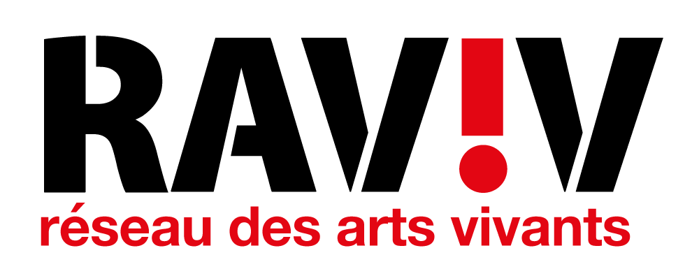
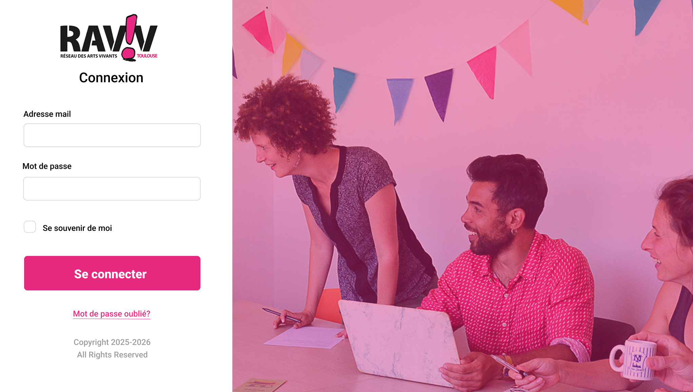

# DOCUMENT DE CONCEPTION

---

## 1. Architecture générale
## 2. Conception
### 2.1 Présentation de la solution
#### Maquettes

|  |
|:-----------------------------------------:|
| *Figure 2.1.1 - Maquette du portail de connexion aux services RAVIV* |

### 2.2 Réalisation de la solution
## 3. Contraintes techniques
## Table des illustrations

---

**Auteurs**  
Thomas Aussenac  
Alban-Moussa Estienne  
Jules Giard--Pellat  
Victor Jockin  
Mathys Laguilliez  
Quentin Martinez  

***BUT Informatique 3ème Année***  
*IUT de Blagnac, Université Toulouse II - Jean Jaurès (31)*

**Destinataire**  
RAVIV