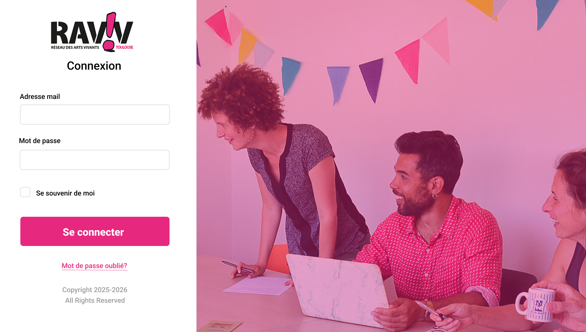

# Document de conception

---

## Sommaire
[1. Architecture générale](#1-architecture-générale)
[2. Conception](#2-conception)
&emsp;[2.1. Présentation de la soluation](#21-présentation-de-la-solution)
&emsp;&emsp;[2.1.1. Maquettes](#211-maquettes)
&emsp;[2.2. Réalisation de la solution](#22-réalisation-de-la-solution)
[3. Contraintes techniques](#3-contraintes-techniques)

---

## 1. Architecture générale
## 2. Conception
### 2.1 Présentation de la solution
#### 2.1.1. Maquettes

|  |
|:-:|
| Figure 2.1.1 - Maquette du portail de connexion aux services RAVIV |

### 2.2 Réalisation de la solution
## 3. Contraintes techniques

---

**Auteurs**  
Thomas Aussenac  
Alban-Moussa Estienne  
Jules Giard--Pellat  
Victor Jockin  
Mathys Laguilliez  
Quentin Martinez  

***BUT Informatique 3ème Année***  
*IUT de Blagnac, Université Toulouse II - Jean Jaurès (31)*

**Destinataire**  
RAVIV