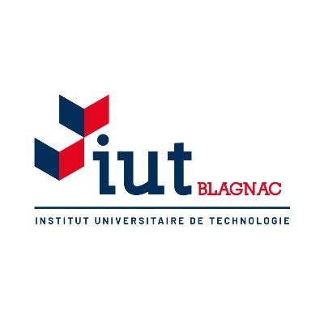

# DOCUMENTATION TECHNIQUE

## 1. Présentation de l'application
## 2. Architecture
## 3. Conception et mise en oeuvre de fonctionnalités
## 4. Procédures d'installation

---

---

**Auteurs**  
Thomas Aussenac  
Alban-Moussa Estienne  
Jules Giard--Pellat  
Victor Jockin  
Mathys Laguilliez  
Quentin Martinez  

**BUT Informatique 3ème Année**  
IUT de Blagnac, Université Toulouse II - Jean Jaurès (31)

**Destinataire**
RAVIV