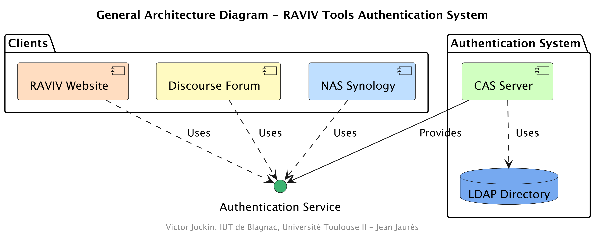

# Documentation technique

  
  


---

## Sommaire
[1. Présentation de la solution](#1-présentation-de-la-solution)  
&emsp;[1.1 Objectif de la solution](#11-objectif-et-fonctionnement)  
&emsp;[1.2 Description des fonctionnalités](#12-description-des-fonctionnalités)  
[2. Architecture de la solution](#2-architecture-de-la-solution)  
&emsp;[2.1. Architecture générale](#21-architecture-générale)  
&emsp;[2.2. Arborescence](#22-arborescence)  
[3. Conception et mise en oeuvre des fonctionnalités](#3-conception-et-mise-en-oeuvre-des-fonctionnalités)  
[4. Procédures d'installation](#4-procédures-dinstallation)

---

## 1. Présentation de la solution

### 1.1 Objectif et fonctionnement

La solution développée a pour objectif de fournir un système d'authentification commun aux différents outils proposés par RAVIV, à savoir le site web de l'association, un forum Discourse, ainsi qu'un NAS Synology.

### 1.2 Description des fonctionnalités

#### **CRUD Utilisateurs**
Création, lecture, modification, suppression d'un utilisateur de l'annuaire LDAP.

#### **CRUD Groupes**
Création, lecture, modification, suppression d'un groupe de l'annuaire LDAP. Cela permettra notamment d'affecter des droits aux utilisateurs.

#### **Connexion aux outils de RAVIV**
Si l'utilisateur se connecte sur l'un des outils RAVIV, alors l'utilisateur peux accéder aux deux autres sans avoir besoin de se connecter.

#### **Déconnexion des outils RAVIV**
Si l'utilisateur se déconnecte sur l'un des outils RAVIV, alors l'utilisateur est déconnecté sur l'ensemble des outils.

## 2. Architecture de la solution

### 2.1. Architecture générale

|  |
|:-:|
| Figure 2.1 - Diagramme d'Architecture Générale |

### 2.2. Arborescence

#### *Arborescence du projet*

```
sae-raviv-5.A.01/
├── cas-ldap/
│   └── cas/
│       ├── build.gradle
│       ├── docker-compose.yml
│       ├── Dockerfile
│       ├── etc/
│       │   └── cas/
│       │       └── config/
│       ├── gradle/
│       └── src/
├── docs/
│   ├── docuser.md
│   ├── doctech.md
│   └── assets/
│       └── img/
├── infra/
│   ├── docker-compose.yml
│   ├── cas/
│   ├── discourse/
│   ├── grav/
│   └── nextcloud/
└── login-portal-template/
    ├── login.html
    └── main.css
```

#### *Description des répertoires et fichiers*

**`cas-ldap/`** : Contient l'implémentation du serveur CAS (Central Authentication Service) avec intégration LDAP.

  - **`cas/`** : Répertoire principal du serveur CAS.

  - **`build.gradle`** : Fichier de configuration Gradle pour la compilation et les dépendances du projet CAS.

  - **`docker-compose.yml`** : Configuration Docker Compose pour le déploiement local du serveur CAS.

  - **`Dockerfile`** : Instructions de construction de l'image Docker du serveur CAS.

  - **`etc/cas/config/`** : Fichiers de configuration du serveur CAS (application.properties, application.yml, etc.).

  - **`gradle/`** : Scripts et configuration Gradle pour la gestion du projet.

  - **`src/`** : Code source Java du serveur CAS customisé.

**`docs/`** : Documentation complète du projet.

  - **`docuser.md`** : Documentation utilisateur détaillant les procédures d'utilisation.

  - **`doctech.md`** : Documentation technique (architecture, installation, configuration).

  - **`assets/img/`** : Ressources images (diagrammes, captures d'écran, logos).

**`infra/`** : Infrastructure de déploiement et configuration des services.

  - **`docker-compose.yml`** : Contient l'ensemble des images servant à simuler les différents services RAVIV (CAS, LDAP, Nextcloud, Grav, Discourse).

  - **`cas/`** : Configuration et certificats pour le serveur CAS de production.

  - **`discourse/`** : Configuration spécifique au forum Discourse.

  - **`grav/`** : Configuration du CMS Grav (site web RAVIV).

  - **`nextcloud/`** : Configuration et applications personnalisées pour Nextcloud (NAS).

**`login-portal-template/`** : Modèle de page de connexion unifiée.

  - **`login.html`** : Template HTML de la page de connexion centralisée.

  - **`main.css`** : Feuilles de style pour l'interface de connexion.

## 3. Conception et mise en oeuvre des fonctionnalités
## 4. Procédures d'installation

---

**Auteurs**  
Thomas Aussenac  
Alban-Moussa Estienne  
Jules Giard--Pellat  
Victor Jockin  
Mathys Laguilliez  
Quentin Martinez  

***BUT Informatique 3ème Année***  
*IUT de Blagnac, Université Toulouse II - Jean Jaurès (31)*

**Destinataire**  
RAVIV