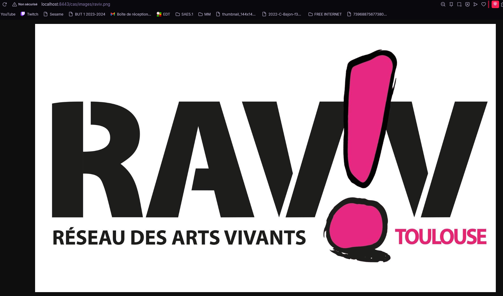

# Documentation technique

  

---

## Sommaire
[1. Présentation de la solution](#1-présentation-de-la-solution)  
&emsp;[1.1 Objectif de la solution](#11-objectif-et-fonctionnement)  
&emsp;[1.2 Description des fonctionnalités](#12-description-des-fonctionnalités)  
[2. Architecture de la solution](#2-architecture-de-la-solution)  
&emsp;[2.1. Architecture générale](#21-architecture-générale)  
&emsp;[2.2. Arborescence](#22-arborescence)  
[3. Conception et mise en oeuvre des fonctionnalités](#3-conception-et-mise-en-oeuvre-des-fonctionnalités)  
&emsp;[3.1. Intégration du portail de connexion](#31-intégration-du-portail-de-connexion)  
&emsp;&emsp;[3.1.1. Technologies utilisées](#311-technologies-utilisées)  
&emsp;&emsp;[3.1.2. Architecture du projet Apereo CAS](#312-architecture-du-projet-apereo-cas)  
&emsp;&emsp;[3.1.3. Intégration du template](#313-intégration-du-template)  
&emsp;&emsp;[3.1.4. Gestion de la réinitialisation des mots de passe](#314-gestion-de-la-réinitialisation-des-mots-de-passe)  
&emsp;&emsp;[3.1.5. Résolution du problème d'affichage du logo](#315-résolution-du-problème-daffichage-du-logo)  
[4. Procédures d'installation](#4-procédures-dinstallation)

---

## 1. Présentation de la solution

### 1.1 Objectif et fonctionnement

La solution développée a pour objectif de fournir un système d'authentification commun aux différents outils proposés par RAVIV, à savoir le site web de l'association, un forum Discourse, ainsi qu'un NAS Synology.

### 1.2 Description des fonctionnalités

#### **CRUD Utilisateurs**
Création, lecture, modification, suppression d'un utilisateur de l'annuaire LDAP.

#### **CRUD Groupes**
Création, lecture, modification, suppression d'un groupe de l'annuaire LDAP. Cela permettra notamment d'affecter des droits aux utilisateurs.

#### **Connexion aux outils de RAVIV**
Si l'utilisateur se connecte sur l'un des outils RAVIV, alors l'utilisateur peux accéder aux deux autres sans avoir besoin de se connecter.

#### **Déconnexion des outils RAVIV**
Si l'utilisateur se déconnecte sur l'un des outils RAVIV, alors l'utilisateur est déconnecté sur l'ensemble des outils.

## 2. Architecture de la solution

### 2.1. Architecture générale

|  |
|:-:|
| Figure 2.1 - Diagramme d'Architecture Générale |

### 2.2. Arborescence

#### *Arborescence du projet*

```
sae-raviv-5.A.01/
├── cas-ldap/
│   └── cas/
│       ├── build.gradle
│       ├── docker-compose.yml
│       ├── Dockerfile
│       ├── etc/
│       │   └── cas/
│       │       └── config/
│       ├── gradle/
│       └── src/
├── infra/
│   ├── docker-compose.yml
│   ├── cas/
│   ├── discourse/
│   ├── grav/
│   └── nextcloud/
└── login-portal-template/
    ├── login.html
    └── main.css
```

#### *Description des répertoires et fichiers*

**`cas-ldap/`** : Contient l'implémentation du serveur CAS (Central Authentication Service) avec intégration LDAP.

  - **`cas/`** : Répertoire principal du serveur CAS.

  - **`build.gradle`** : Fichier de configuration Gradle pour la compilation et les dépendances du projet CAS.

  - **`docker-compose.yml`** : Configuration Docker Compose pour le déploiement local du serveur CAS.

  - **`Dockerfile`** : Instructions de construction de l'image Docker du serveur CAS.

  - **`etc/cas/config/`** : Fichiers de configuration du serveur CAS (application.properties, application.yml, etc.).

  - **`gradle/`** : Scripts et configuration Gradle pour la gestion du projet.

  - **`src/`** : Code source Java du serveur CAS customisé.

**`infra/`** : Infrastructure de déploiement et configuration des services.

  - **`docker-compose.yml`** : Contient l'ensemble des images servant à simuler les différents services RAVIV (CAS, LDAP, Nextcloud, Grav, Discourse).

  - **`cas/`** : Configuration et certificats pour le serveur CAS de production.

  - **`discourse/`** : Configuration spécifique au forum Discourse.

  - **`grav/`** : Configuration du CMS Grav (site web RAVIV).

  - **`nextcloud/`** : Configuration et applications personnalisées pour Nextcloud (NAS).

**`login-portal-template/`** : Modèle de page de connexion unifiée.

  - **`login.html`** : Template HTML de la page de connexion centralisée.

  - **`main.css`** : Feuilles de style pour l'interface de connexion.

## 3. Conception et mise en oeuvre des fonctionnalités

### 3.1. Intégration du portail de connexion

Cette section décrit le processus d'intégration du template du portail de connexion au serveur CAS. L'objectif était de remplacer la page de connexion par défaut fournie par Apereo CAS par une interface personnalisée respectant la charte graphique RAVIV, tout en conservant toutes les fonctionnalités d'authentification centralisée du système SSO.

> En raison de problèmes techniques décrits plus bas, l'intégration du portail n'a pas pu être finalisée.

#### 3.1.1 Technologies utilisées

##### Réalisation du portail

| **TECHNOLOGIES** | **RÔLE** |
|:-----------------|:---------|
| **HTML5** | Structure des pages |
| **CSS3** | Styles personnalisés avec variables CSS |
| **JavaScript/jQuery** | Interactions client et requêtes |
| **Google Fonts** | `Noto Sans` pour la typographie |

##### Intégration

| **Technologie** | **Version** | **Rôle** |
|:----------------|:------------|:---------|
| **Apereo CAS** | 7.x | Serveur d'authentification centralisée (SSO) |
| **Thymeleaf** | 3.x | Moteur de templates côté serveur pour Java |
| **Spring Boot** | 3.x | Framework Java pour CAS |
| **Gradle** | 8.x | Outil de build et gestion de dépendances |
| **Docker** | Latest | Conteneurisation et déploiement |

CAS utilise **Thymeleaf** comme moteur de templates, qui permet :
- L'injection de données dynamiques dans les pages HTML
- La gestion de fragments réutilisables
- L'internationalisation (i18n)
- L'intégration avec Spring Security

#### 3.1.2. Architecture du projet Apereo CAS

##### Arborescence des fichiers

###### Templates
```
cas-ldap/cas/src/main/resources/templates/
├── layout.html                           # Template de base (layout principal)
├── login/
│   └── casLoginView.html                 # Vue principale de connexion
├── fragments/
│   ├── loginform.html                    # Fragment du formulaire de connexion
│   ├── pmlinks.html                      # Fragment des liens de gestion de compte
│   ├── header.html                       # Fragment de l'en-tête
└── └── footer.html                       # Fragment du pied de page

```

###### Ressources statiques
```
cas-ldap/cas/src/main/resources/static/
├── css/
│   └── main.css                        # Styles personnalisés RAVIV
├── images/
│   ├── raviv.png                       # Logo RAVIV
│   └── big-image.png                   # Image de fond
└── js/
    └── [scripts personnalisés]
```

##### Hiérarchie des templates `Thymeleaf`

```
┌─────────────────────────┐
│     layout.html         │  ← Template de base
│   (Structure globale)   │
└───────────┬─────────────┘
            │
            ├── Fragments réutilisables
            │   ├── header.html
            │   ├── footer.html
            │   └── scripts.html
            │
            ↓
┌─────────────────────────┐
│  casLoginView.html      │  ← Vue spécifique de connexion
│   layout:decorate       │
└───────────┬─────────────┘
            │
            ↓
┌─────────────────────────┐
│   loginform.html        │  ← Fragment du formulaire
│   (Inséré dynamiquement)│
└─────────────────────────┘
```

#### 3.1.3. Intégration du template

##### Analyse du template initial

Le template du portail de connexion réalisé (`login-portal-template/login.html`) contient :
- Une structure de page en HTML pur avec CSS personnalisé
- Un formulaire de connexion avec champs username/password
- Un design responsive avec image de fond
- Une charte graphique RAVIV (couleurs, logo, typographie)

##### Adaptation au système Thymeleaf

###### Étape 1 : Conversion des chemins statiques

**Avant (HTML statique) :**
```html
<link rel="stylesheet" href="main.css">

```

**Après (Thymeleaf) :**
```html
<link rel="stylesheet" th:href="@{/css/main.css}" href="/css/main.css">

```

**Explications :**
- `th:href="@{/css/main.css}"` : Syntaxe Thymeleaf pour résolution d'URL contextuelle
- Le chemin `/css/main.css` correspond à `src/main/resources/static/css/main.css`
- CAS sert automatiquement les fichiers du dossier `static/` à la racine web

###### Étape 2 : Intégration des attributs Thymeleaf dans le formulaire

**Avant (HTML statique) :**
```html
<input type="text" name="username" required>
<input type="password" name="password" required>
<input type="hidden" name="lt" value="${lt}">
<input type="hidden" name="execution" value="${execution}">
```

**Après (Thymeleaf intégré) :**
```html
<input type="text" 
       id="username"
       name="username"
       th:field="*{username}"
       th:readonly="!${@casThymeleafTemplatesDirector.isLoginFormUsernameInputVisible(#vars)}"
       autocapitalize="none"
       spellcheck="false"
       autocomplete="username"
       required />

<input type="password"
       id="password"
       name="password"
       th:field="*{password}"
       autocomplete="off"
       required />

<input type="hidden" name="execution" th:value="${flowExecutionKey}"/>
<input type="hidden" name="_eventId" value="submit"/>
```

**Explication des attributs Thymeleaf :**
- `th:field="*{username}"` : Binding bidirectionnel avec l'objet credential du modèle Spring
- `th:value="${flowExecutionKey}"` : Injection de la clé d'exécution du Spring Web Flow
- `th:readonly` : Conditionne l'état readonly selon la logique CAS
- `@casThymeleafTemplatesDirector` : Bean Spring gérant la logique d'affichage CAS

###### Étape 3 : Gestion des erreurs d'authentification

**Ajout du bloc d'affichage des erreurs :**
```html
<div class="error-banner" th:if="${#fields.hasErrors('*')}" role="alert">
    <div class="error-icon">⚠️</div>
    <div class="error-content">
        <h3 class="error-title">Échec de l'authentification</h3>
        <p class="error-message" th:each="err : ${#fields.errors('*')}" 
           th:utext="${err}">Example error</p>
        <p class="error-help">Vérifiez votre adresse mail et votre mot de passe, puis réessayez.</p>
    </div>
</div>
```

**Explications :**
- `th:if="${#fields.hasErrors('*')}"` : Affiche le bloc uniquement si des erreurs existent
- `#fields.errors('*')` : Récupère toutes les erreurs de validation du formulaire
- `th:each` : Itère sur chaque erreur pour l'afficher
- `th:utext` : Affiche le texte sans échapper le HTML (nécessaire pour les messages i18n)

##### Structure du fragment loginform.html

**Organisation du fragment :**
```html
<div th:fragment="loginform">
    <!-- En-tête avec logo et titre -->
    <div id="header">
        
        <span id="connexion">Connexion</span>
    </div>
    
    <!-- Affichage des erreurs (conditionnel) -->
    <div class="error-banner" th:if="${#fields.hasErrors('*')}">
        <!-- Contenu erreur -->
    </div>
    
    <!-- Champs du formulaire -->
    <div class="form-field" id="usernameSection">
        <!-- Input username -->
    </div>
    
    <div class="form-field" id="passwordSection">
        <!-- Input password -->
    </div>
    
    <!-- Checkbox "Se souvenir de moi" -->
    <div class="form-option" th:if="${rememberMeAuthenticationEnabled}">
        <!-- Checkbox remember-me -->
    </div>
    
    <!-- Champs cachés pour Spring Web Flow -->
    <input type="hidden" name="execution" th:value="${flowExecutionKey}"/>
    <input type="hidden" name="_eventId" value="submit"/>
    
    <!-- Bouton de soumission -->
    <div class="form-actions">
        <button type="submit" name="_eventId" value="submit">Se connecter</button>
    </div>
    
    <!-- Copyright -->
    <div id="copyright">
        <span>Copyright RAVIV &copy; 2025</span>
        <span>Tous droits réservés.</span>
    </div>
</div>
```

#### 3.1.4. Gestion de la réinitialisation des mots de passe

##### Politique de gestion des mots de passe RAVIV

RAVIV a fait le choix de gérer la réinitialisation des mots de passe de manière centralisée et sécurisée via l'administration système, plutôt que par un système automatisé en libre-service. 

**Cette approche présente plusieurs avantages :**
1. **Contrôle renforcé** : Chaque demande de réinitialisation est vérifiée manuellement
2. **Sécurité accrue** : Évite les attaques par énumération d'utilisateurs
3. **Traçabilité** : Historique complet des réinitialisations
4. **Support personnalisé** : Accompagnement direct des utilisateurs

##### Processus de réinitialisation d'un mot de passe

**Démarche à suivre pour les utilisateurs :**

1. **Contact de l'administrateur système**
   - Email : `[Email à renseigner]`
   - Objet : Réinitialisation de mot de passe
   - Informations à fournir : Nom complet, adresse email du compte

2. **Vérification d'identité**
   - L'administrateur vérifie l'identité du demandeur
   - Validation de la légitimité de la demande

3. **Réinitialisation du mot de passe**
   - L'administrateur réinitialise le mot de passe dans l'annuaire LDAP
   - Envoi sécurisé du nouveau mot de passe temporaire

4. **Première connexion**
   - L'utilisateur se connecte avec le mot de passe temporaire
   - (Optionnel) Changement obligatoire au premier login

#### 3.1.5. Résolution du problème d'affichage du logo

##### Problème identifié

Lors de l'intégration initiale, le logo RAVIV ne s'affichait pas sur la page de connexion malgré la présence du fichier image et la configuration apparemment correcte.

##### Analyse du problème

**Référence dans le template :**
```html

```

**Structure des fichiers :**
```
src/main/resources/static/
├── images/
│   ├── raviv.png          # Fichier présent
│   ├── big-image.png
└── └── 
...
```

##### Causes possibles

**1. Problème de cache du navigateur :**
- Le navigateur conserve l'ancienne version de la page
- Les ressources statiques ne sont pas rechargées

**2. Image non copiée lors du build Docker :**
- Le Dockerfile ne copie pas correctement les ressources statiques
- Les fichiers dans `src/main/resources/static/` ne sont pas inclus dans le WAR

**3. Problème de chemin contextuel :**
- CAS peut nécessiter un chemin contextuel (`/cas/images/...`)
- La configuration du serveur peut affecter les chemins statiques

**4. Build incomplet ou ancien :**
- Le conteneur Docker utilise une ancienne version de l'image
- Le build Gradle n'a pas correctement packagé les ressources

##### Solutions testées

###### Solution 1 : Vider le cache du navigateur
```
1. Ouvrir les outils de développement (F12)
2. Clic droit sur le bouton Actualiser
3. Sélectionner "Vider le cache et actualiser"
```

Ou en navigation privée :
```
Ctrl + Shift + N (Chrome)
Ctrl + Shift + P (Firefox)
```

###### Solution 2 : Vérifier la configuration du chemin

**Utiliser le helper Thymeleaf pour les ressources statiques :**
```html
<!-- AVANT (chemin absolu simple) -->


<!-- APRÈS (helper Thymeleaf) -->

```

**Avantage du helper `@{...}` :**
- Résolution automatique du contexte CAS (`/cas/...`)
- Gestion des URL relatives et absolues
- Compatibilité avec les proxies inverses

##### Vérification finale

**Checklist de vérification :**
- [x] Fichier `raviv.png` présent dans `src/main/resources/static/images/`
- [x] Chemin correct dans le template : `th:src="@{/images/raviv.png}"`
- [x] Build Gradle réussi sans erreurs
- [x] Image présente dans le WAR (vérification manuelle)
- [x] Conteneur Docker redémarré avec la nouvelle image
- [x] Cache navigateur vidé ou navigation privée
- [ ] Image visible sur https://localhost:8443/cas/login
- [ ] Aucune erreur 404 dans les logs CAS
- [ ] Console navigateur sans erreur de chargement

**Test d'accès direct à l'image :**
```
https://localhost:8443/cas/images/raviv.png
```

L'image est trouvé : 



## 4. Procédures d'installation

---

**Auteurs**  
Thomas Aussenac  
Alban-Moussa Estienne  
Jules Giard--Pellat  
Victor Jockin  
Mathys Laguilliez  
Quentin Martinez  

***BUT Informatique 3ème Année***  
*IUT de Blagnac, Université Toulouse II - Jean Jaurès (31)*

**Destinataire**  
RAVIV