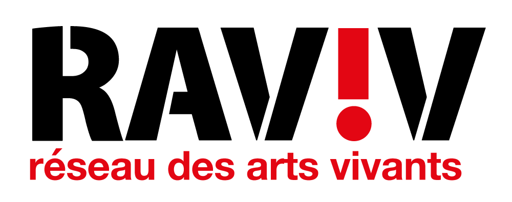
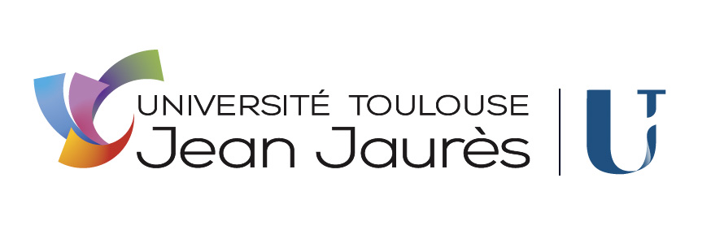

# DOCUMENTATION TECHNIQUE

---

## 1. Présentation de l'application
## 2. Architecture
## 3. Conception et mise en oeuvre de fonctionnalités
## 4. Procédures d'installation
## Table des illustrations
% lof %

---

**Auteurs**  
Thomas Aussenac  
Alban-Moussa Estienne  
Jules Giard--Pellat  
Victor Jockin  
Mathys Laguilliez  
Quentin Martinez  

***BUT Informatique 3ème Année***  
*IUT de Blagnac, Université Toulouse II - Jean Jaurès (31)*

**Destinataire**  
RAVIV