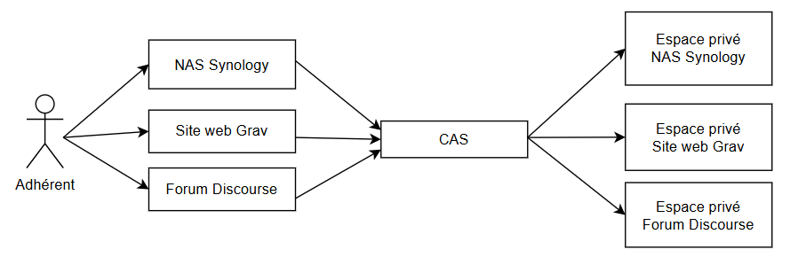

# Documentation utilisateur

  
  

---

## Sommaire
[1. Présentation de l'application](#1-présentation-de-lapplication)  
[2. Fonctionnalités](#2-fonctionnalités)  
[2.1 Fonctionnalités administrateur](#21-fonctionnalités-administrateur)  
[2.1.1 Ajouter un utilisateur](#211-ajouter-un-utilisateur)  

---

## 1. Présentation de l'application

## 2. Fonctionnalités

|  |
|:-----------------------------------------:|
| Figure 2.1 - Use Case Général |

---

### 2.1. Fonctionnalités administrateur

#### 2.1.1. Ajouter un utilisateur 

| **Identifiant (ID)** | F-01-01 |
|:----------------|:----------------|
| **Fonctionnalité** | Ajouter un utilisateur |
| **Description** | L'ajout d'un compte permet de créer un nouveau compte utilisateur dans le système. Lorsqu'un utilisateur est ajouté :  - L'utilisateur est enregistré dans la liste des utilisateurs de l'association RAVIV. - Un compte utilisateur est créé avec les informations fournies. - L'utilisateur peut immédiatement accéder aux services connectés (forum Discourse, Nextcloud, site web Grav). |

| **Prérequis** |
|:-------:|
- Être connecté à l'annuaire LDAP en tant qu'*Administrateur*. 

| **Étapes d'utilisations** |
|:-------:|

**Étape 1 :** Dans la page de `connexion`, enregistrez-vous en tant qu'administrateur avec le login et le mot de passe fournis.

---
**Étape 2 :** Une fois dans la fenêtre d'administration, si vous voulez ajouter un nouvel utilisateur pour la première fois, il faut créer dans un premier temps un groupe. Pour ajouter un groupe cliquer sur `ou=groups`.

---

**Étape 3 :**
Cliquez ensuite sur `Create a child entry`, puis sur `New Posix Group`. Une fois cela effectué, un formulaire apparaît, vous devez y saisir
- `Group` : Le nom du groupe
- `GID Number`: Group IDenfier Number, cela permettra de gérer les droits d'accès...
- `Users` : Sélectionner les potentiels utilisateurs déjà existants pouvant être ajoutés à ce nouveau groupe

Voici un exemple de saisie :

Une fois cela fait, appuyez sur le bouton `Create object`, une nouvelle et dernière page apparaît pour `commit` l'ajout du nouveau groupe :

Ainsi vous pouvez visualiser votre groupe dans la liste `ou=groups`, dans notre cas nous pouvons voir le groupe `cn=Nouveau Groupe`

---

> ⚠️​ **IMPORTANT** ⚠️​  
> **Il est obligatoire de créer un groupe avant de pouvoir 
> créer un utilisateur !**  
> Sans groupe existant, vous ne pouvez passez à l'étape suivante.

**Étape 4 :**
Maintenant, nous allons pouvoir ajouter un utilisateur, la méthode est similaire à l'ajout d'un groupe. Comme précédemment, pour ajouter un utilisateur cliquer sur `ou=users`.

Cliquez ensuite sur `Create a child entry`, puis sur `Generic: User Account`. 

Une fois cela effectué, un formulaire apparaît, vous devez y saisir
- `First name` : Le prénom de l'utilisateur
- `Last name` : Le nom de l'utilisateur
- `Common Name` : Le nom commun composé de la façon suivante : Prenom Nom
- `User ID` : Le user ID est généré automatiquement avec les informations écrites précédemment
- `Password` : Le mot de passe de l'utilisateur
- `UID Number` : User IDenfier Number
- `GID Number` : La liaison avec le groupe dans l'étape 3
- `Home Directory` : Le répertoire personnel de l'utilisateur
- `Login shell` : L'interpréteur de commande

Voici un exemple de saisie :

Une fois cela fait, appuyez sur le bouton `Create object`, une nouvelle et dernière page apparaît pour `commit` l'ajout du nouvel utilisateur :

Ainsi vous pouvez visualiser votre utilisateur dans la liste `ou=users`, dans notre cas nous pouvons voir l'utilisateur `cn=John Powell`

**Auteurs**  
Thomas Aussenac  
Alban-Moussa Estienne  
Jules Giard--Pellat  
Victor Jockin  
Mathys Laguilliez  
Quentin Martinez  

***BUT Informatique 3ème Année***  
*IUT de Blagnac, Université Toulouse II - Jean Jaurès (31)*

**Destinataire**  
RAVIV